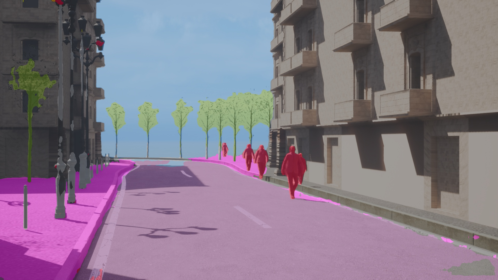

# Assess the gap between synthetic data and real data

 `python main.py` performs inference of a pre-trained Cityscapes PSPNet on our synthetic data. \
See results at [Cityscapes2Others.md](Cityscapes2Others.md).



*Inference on Twincity example image, from a PSPNet trained on Cityscapes*

In the future we will add :
- Training a PSPNet on our synthetic data and apply it on Cityscapes (& Mapillary Vistas)


# Step-by step

## Installation
This repo is mainly based on mmsegentation, see [README_install.md](README_install.md)

## Dataset Download and preparation

### Twincity dataset
  - download (contact us directly for the dataset)
  - set `$TWINCITY_ROOT` in configs/paths_cfg 


The dataset should look like this : 
```
TwincityUnreal
│   SemanticClasses.csv
│
└───v1
│   ...

│
└───v2
   │   file011.txt
   │   file012.txt
   │
   └───ColorImage
   │    │   BasicSequencer.0000img.jpeg
   │    │   BasicSequencer.0001img.jpeg
   │    │   ...
   │ 
   └───SemanticImage  
       │   BasicSequencer.0001seg.jpeg
       │   BasicSequencer.0002seg.jpeg
       │   ...
```

- Run `python src/preprocessing/proprocess_twincity.py` (temporary fix to handle the semantic extractor)

It should have added a folder `SemanticImage-format-cityscapes`.


## Perform inference
- Set the paths non already changed of configs/paths_cfg.py
  - `$CHECKPOINT_DIR` where pre-trained models will be downloaded (few hundred mo)
  - `$OUT_ROOT` where results are stored (images, metrics)
- from the root folder : `python main.py`
- One ran, look at the results either at
  - .csv format [.csv table](output/benchmark/Cityscapes-2-Others.csv)
  - .md format [.md table](Cityscapes2Others.md)

--------------------------------------------------------------

--------------------------------------------------------------


# Optional : add other datasets


### (Optional) GTAV dataset
- Download GTAV semantic segmentation dataset
- set `GTAV_ROOT` in configs/paths_cfg
- Structure should be as follow :

```
GTAV
│
└───images
│   │   00001.png
│   │   00002.png
│   
│   
└───labels
    │   00001.png
    │   00002.png
```

### (Optional) Other datasets

- Real
  - 1 MapillaryVistas
  - 2 ADE20K
- Synthetic
  - 1 CARLA
  - 2 Twincity Unity
  - 3 PeopleSansPeople


This project is a joint project between Entrepreneur d'Interet General of Etalab, and the Ministry of Interior.